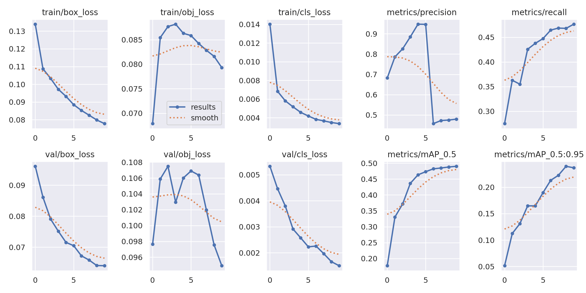
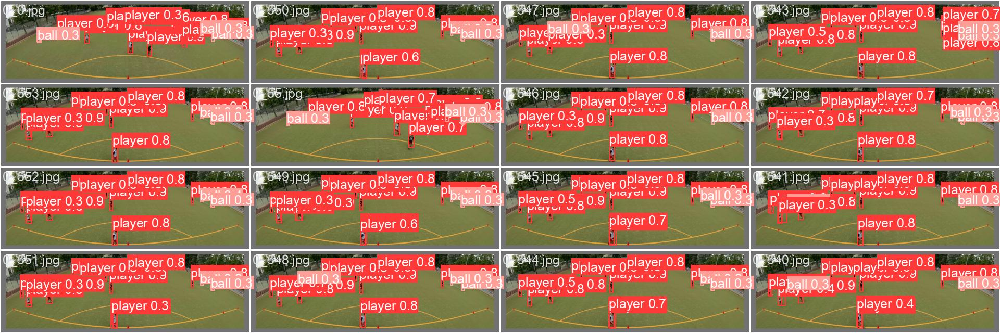

# [PYTHON] YOLO (You Only Look Once)
## How to use my code

With my code, you can:
* **Train your model from scratch**
* **Train your model with my trained model**
* **Evaluate test images with either my trained model or yours**
## Requirements:

* **python**
* **pprint**
* **pandas**
* **glob**
* **opencv (cv2)**
* **tensorboard**
* **shutil**
* **json**

# Football Object Detection
This project utilizes object detection algorithms to analyze football matches videos by finding the position of different objects on the football pitch and classifying them into 7 different classes:  
0 - Player   
1 - Ball
## Build Your Own Training Set Configuration and Model Configuration
Model Configuration File:
```yaml
#yolov8x-seg_custom.yaml
# Parameters
# Parameters
nc: 1  # number of classes
depth_multiple: 1.00  # scales module repeats
width_multiple: 1.25  # scales convolution channels

# YOLOv8.0x backbone
backbone:
  # [from, repeats, module, args]
  - [-1, 1, Conv, [64, 3, 2]]  # 0-P1/2
  - [-1, 1, Conv, [128, 3, 2]]  # 1-P2/4
  - [-1, 3, C2f, [128, True]]
  - [-1, 1, Conv, [256, 3, 2]]  # 3-P3/8
  - [-1, 6, C2f, [256, True]]
  - [-1, 1, Conv, [512, 3, 2]]  # 5-P4/16
  - [-1, 6, C2f, [512, True]]
  - [-1, 1, Conv, [512, 3, 2]]  # 7-P5/32
  - [-1, 3, C2f, [512, True]]
  - [-1, 1, SPPF, [512, 5]]  # 9

# YOLOv8.0x head
head:
  - [-1, 1, nn.Upsample, [None, 2, 'nearest']]
  - [[-1, 6], 1, Concat, [1]]  # cat backbone P4
  - [-1, 3, C2f, [512]]  # 13

  - [-1, 1, nn.Upsample, [None, 2, 'nearest']]
  - [[-1, 4], 1, Concat, [1]]  # cat backbone P3
  - [-1, 3, C2f, [256]]  # 17 (P3/8-small)

  - [-1, 1, Conv, [256, 3, 2]]
  - [[-1, 12], 1, Concat, [1]]  # cat head P4
  - [-1, 3, C2f, [512]]  # 20 (P4/16-medium)

  - [-1, 1, Conv, [512, 3, 2]]
  - [[-1, 9], 1, Concat, [1]]  # cat head P5
  - [-1, 3, C2f, [512]]  # 23 (P5/32-large)

  - [[15, 18, 21], 1, Segment, [nc, 32, 256]]  # Detect(P3, P4, P5)
```

```yaml
#custom_data.yaml

path: /content/drive/MyDrive/YOLO-FOOTBALL/FootBall_Yolo/Football_Yolo_Dataset
train: /content/drive/MyDrive/YOLO-FOOTBALL/FootBall_Yolo/Football_Yolo_Dataset/images/train
val: /content/drive/MyDrive/YOLO-FOOTBALL/FootBall_Yolo/Football_Yolo_Dataset/images/val
test: # test images (optional)

# Classes
names:
  0: player
  1: ball
```
* Make sure to put the files as the following structure:
   ```
  images_and_labels
  ├── images
     │── train
  │   ├── image1.jpg
  │   ├── image2.jpg
     │── val
  │   ├── image1.jpg
  │   └── image2.jpg
   
  │── labels
     │── train
  │   ├── image1.txt
  │   ├── image2.txt
     │── val
  │   ├── image1.txt
  │   └── image2.txt
  ```
  ## Training Hyperparameter Configuration File:
We made simple modifications to the training hyperparameters, which can be passed through command-line arguments or configured in a configuration file.
```yaml
task: "detect" # choices=['detect', 'segment', 'classify', 'init'] # init is a special case. Specify task to run.
mode: "train" # choices=['train', 'val', 'predict'] # mode to run task in.

# Train settings -------------------------------------------------------------------------------------------------------
model: yolov5n.pt, custom_data.yaml. Path to model file
data: footbal.yaml. Path to data file
epochs: 10 # number of epochs to train for
batch: 16 # number of images per batch
imgsz: 640 # size of input images
save: True # save checkpoints
device: '' # cuda device, i.e. 0 or 0,1,2,3 or cpu. Device to run on
project: /content/drive/MyDrive/YOLO-FOOTBALL/results # project name
name: detection_result # experiment name
# optimizer to use, choices=['SGD', 'Adam', 'AdamW', 'RMSProp']
...
```
## YOLOv5 Segmentation Task Training :
* To install the Ultralytics library for YOLO 
```python
%pip install ultralytics
import ultralytics
ultralytics.checks()
```
* Task Training
```python
# Bắt đầu huấn luyện
!python /content/drive/MyDrive/YOLO-FOOTBALL/yolov5-master/train.py --img 640 --batch 16 --epochs 10 --data /content/drive/MyDrive/YOLO-FOOTBALL/footbal.yaml \
--weights /content/drive/MyDrive/YOLO-FOOTBALL/yolov5n.pt --project '/content/drive/MyDrive/YOLO-FOOTBALL/results' --name 'detection_result' --rect
```
* The training/test loss curves for each experiment are shown below:
 
* Prediction Model

* Task Test
```python
!python /content/drive/MyDrive/YOLO-FOOTBALL/yolov5-master/detect.py \
                --weights /content/drive/MyDrive/YOLO-FOOTBALL/results/detection_result/weights/best.pt \
                --source /content/drive/MyDrive/YOLO-FOOTBALL/data/football_test/Match_1864_1_0_subclip/Match_1864_1_0_subclip.mp4 \
                --imgsz 640 --project '/content/drive/MyDrive/YOLO-FOOTBALL/rusult_test' --name 'test_result_detection'
```
## Results
Some output predictions for experiments for each dataset are shown below:
- **Video**
<p align="center">
  <br/>
  <i>My model's output.</i>
</p>
